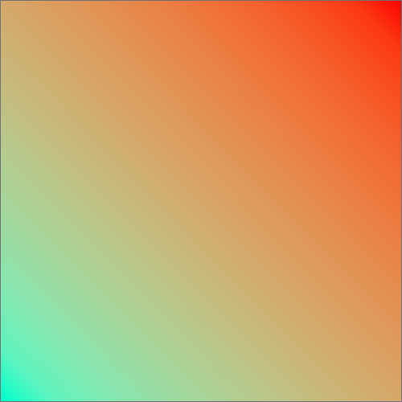
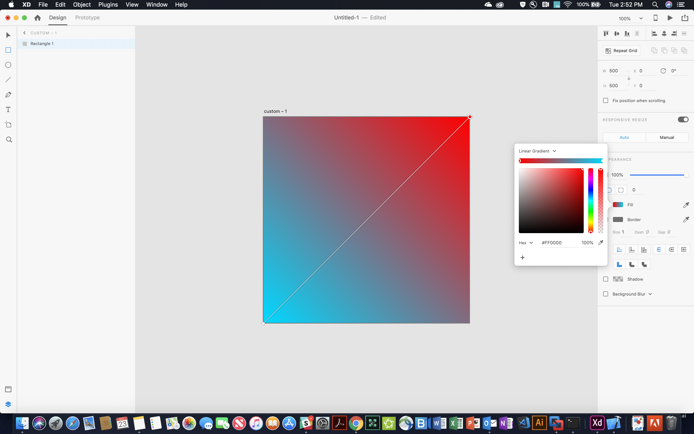
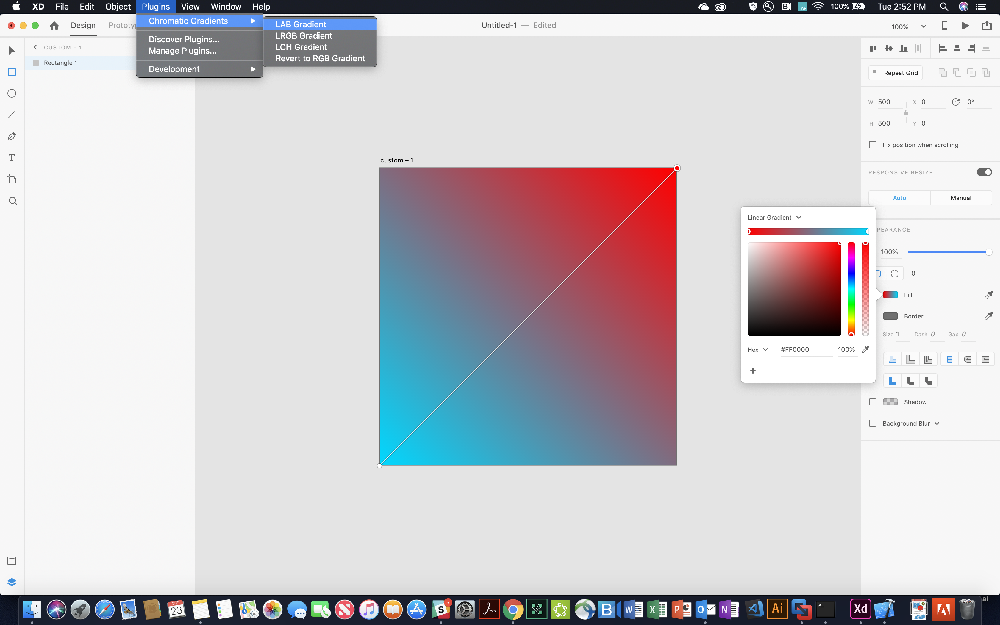
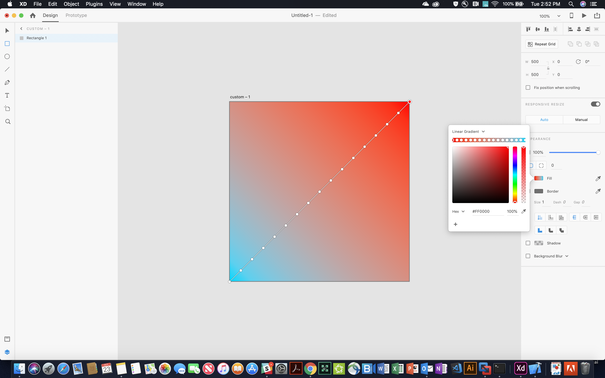

# Chromatic Plugin

This XD plugin lets you create an approximation of a gradient in other color spaces, like LAB.
It is using the [chroma-js](https://github.com/gka/chroma.js/) JavaScript color manipulation library to add more color stops to your gradients.

# Preview

# Prerequisites
[Adobe XD](https://www.adobe.com/products/xd.html) and [Node.js and NPM](https://www.npmjs.com/get-npm)

# Installation
Step by step:
1. [You first have to download this repository.](https://github.com/aancuta/XD_chromaticPlugin/archive/master.zip)
2. Extract the archive and move into the `chromaticPlugin` folder.
3. Install node dependencies: `npm install`
4. Make the plugin package: `npm run zip`
5. Open an XD document, double click `Chromatic Gradients.xdx` and press Yes when prompted to install the plugin.

# Usage
1. [Create your gradient in XD](https://helpx.adobe.com/xd/help/gradients.html)
2. Having your gradient selected, go to the `Plugins` menu and select your prefered gradient color space
3. You can always go back to your original gradient with the `Revert to RGB Gradient` option from the `Plugin` menu, even between different XD sessions

# Usage example

